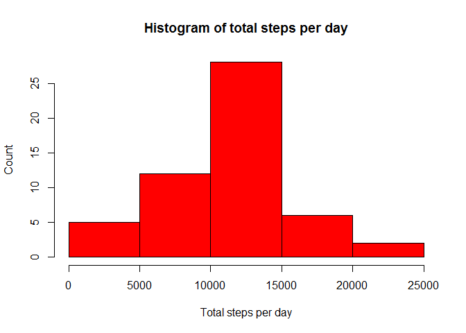
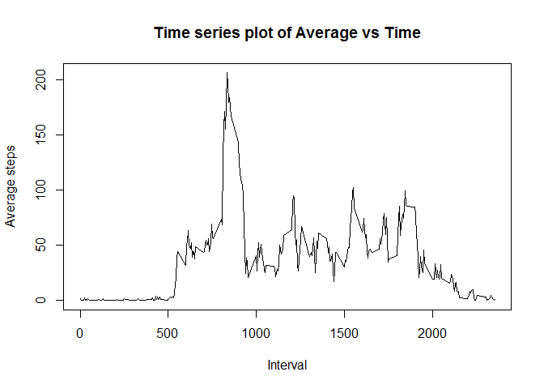
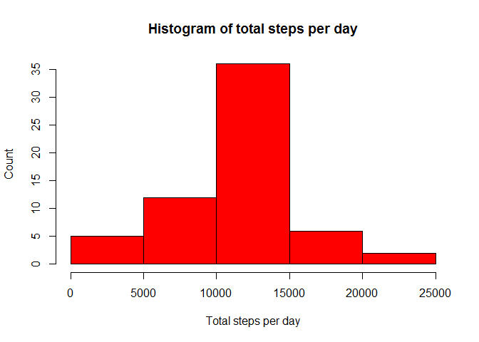

<br>

<br><br><br>
<h3>Loading and preprocessing the data</h3>


```r
act<-read.csv("activity.csv", header = T)                     ## loading the file
act$date<-as.Date(as.character(act$date), "%Y-%m-%d")         ## type-casting into date
act2<-na.omit(act)                                            ## removing NA values
```
<br><br><br>
<h3>What is mean total number of steps taken per day?</h3>


```r
library(dplyr)
```

```
## 
## Attaching package: 'dplyr'
```

```
## The following objects are masked from 'package:stats':
## 
##     filter, lag
```

```
## The following objects are masked from 'package:base':
## 
##     intersect, setdiff, setequal, union
```

```r
## Calculating Total steps per day and plotting histogram

sumsteps <- act2 %>% group_by(date) %>% summarize(totalsteps=sum(steps))
hist(sumsteps$totalsteps, 
     xlab="Total steps per day", 
     ylab="Count", 
     main="Histogram of total steps per day",
     col=2)
```

<!-- -->

```r
averagestep <- mean(sumsteps$totalsteps)
medianstep <- median(sumsteps$totalsteps)
```
The <b>mean</b> of the total number of steps taken per day is <b>1.0766189\times 10^{4}</b> and 
<b>median</b> is <b>10765</b>

<br><br><br>
<h3>What is the average daily activity pattern?</h3>


```r
## Calculating average steps for each time interval and plotting histogram

meansteps <- act2 %>% group_by(interval) %>% summarize(avgsteps=mean(steps))
with(meansteps, plot(interval, avgsteps, type = "l", xlab = "Interval", ylab = "Average steps", main = "Time series plot of Average vs Time"))
```

<!-- -->

```r
inter<-as.data.frame(meansteps[meansteps$avgsteps==max(meansteps$avgsteps),1])
```
The 5-minute <b>interval</b>, on average across all the days in the dataset, that contains the maximum number of steps is <b>835</b>

<br><br><br>
<h3>Inputing missing values</h3>


```r
totmissvals<-sum(is.na(act$steps))
```
The total number of missing values is <b>2304</b>


```r
## Replacing missing values with average for the corresponding time interval

act3<-act
meansteps1<-as.data.frame(meansteps)
for(i in 1:nrow(act3)){
    if(is.na(act3$steps[i])){
        for(j in 1:nrow(meansteps1)){
            if(act3$interval[i]==meansteps1$interval[j])
                act3$steps[i]<-meansteps1$avgsteps[j]
        }
    }
}

## Calculating Total steps per day and plotting histogram for this case

totsteps <- act3 %>% group_by(date) %>% summarize(totalsteps=sum(steps))
hist(totsteps$totalsteps, 
     xlab="Total steps per day", 
     ylab="Count", 
     main="Histogram of total steps per day",
     col=2)
```

<!-- -->

```r
averagestep2 <- mean(totsteps$totalsteps)
medianstep2 <- median(totsteps$totalsteps)
```
The <b>mean</b> of the total number of steps taken per day is <b>1.0766189\times 10^{4}</b> and 
<b>median</b> is <b>1.0766189\times 10^{4}</b>. Therefore, by replacing NA values by the average for that 5-minute interval the <b>mean</b> remained <b>unchanged</b> while the <b>median increased</b> to become <b>equal</b> to the <b>mean</b>

<br><br><br>
<h3>Are there differences in activity patterns between weekdays and weekends?</h3>


```r
## Categorizing date into weekday and weekend

act3$day <- weekdays(act3$date)
act3$dated <- "weekday"
act3$dated[act3$day %in% c("Saturday", "Sunday")] <- "weekend"

## Calculating average steps for each time interval by type of day and plotting histogram

act4 <- act3 %>% group_by(dated, interval) %>% summarise(avgsteps=mean(steps))
library(ggplot2)
qplot(interval, avgsteps, data=act4,
      type="l",
      geom="line",
      xlab="Interval",
      ylab="Number of Steps (Average)",
      main="Average steps taken Weekends vs. Weekdays",
      facets = dated~.)
```

```
## Warning: Ignoring unknown parameters: type
```

<!-- -->
